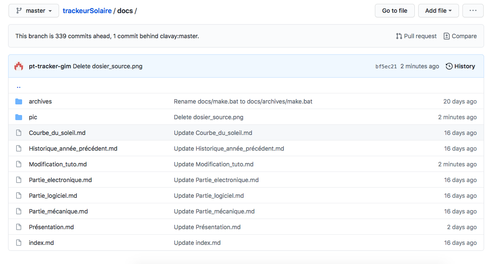
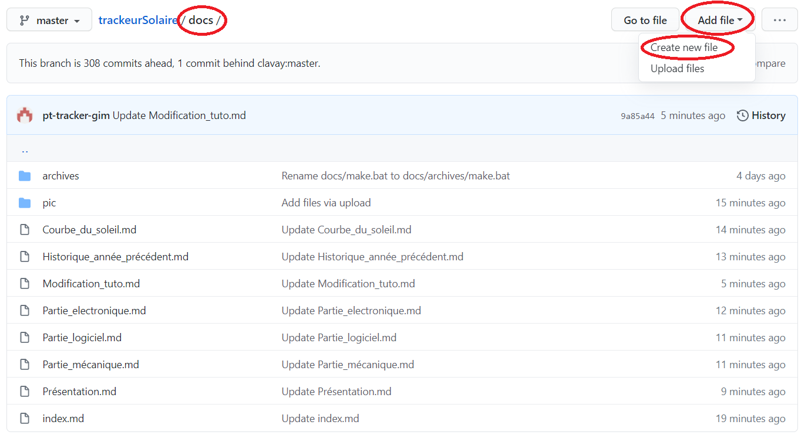
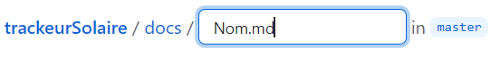
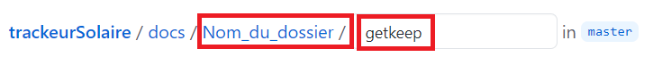

# Modification du site


## Présentation du site


Ce site aura pour but d’aider les futurs étudiants à poursuivre le projet du tracker photovoltaïque et de pouvoir compléter cette base afin d’aider les prochains étudiants.

Elle reprendra le travail réalisé depuis le début de ce projet et des tutoriels qui permettent d’utiliser les différents logiciels.

Elle se décompose en plusieurs partie :

* **La partie supervision :** Elle regroupe toutes les informations sur les différents logiciels de programmation utilisés.
* **La partie mécanique :** Elle regroupe toutes les informations sur les pièces mécaniques qui composent le tracker.
* **La partie électronique :** Elle regroupe toutes les informations sur les différents composants électroniques utilisés (raspberry...).
* **Historique des années précédentes :** Elle regroupe tous les rapports de projet des anciens étudiants sur le projet.
* **Équation du soleil :** Elle regroupe l'étude de l'équation du soleil avec la formule.
* **État d'avancement :** Récapitulatif de l'avancée du projet avec ce qui a été réalisée.
* **Modification du site :** Elle expliquera comment ajouter des informations à cette base de données.


## Navigation dans GITHUB

### Dossier source

 * **PDF:** Ce dossier regroupe tous les rapports en PDF.
  * **PIC:** Ce dossier regroupe toutes les photos utilisé pour les pages. 
  * Les **.md** sont les différentes pages.
  * Le fichier **Index** ...



---------


## Crée une page 

Dans le dossier **docs** , faire **add file** et **Create new file**. 




Entrer le nom du fichier et ajouter a la fin **.md**



---------

## Crée un dossier 

Pour crée un dossier il faut refaire la même manipulation que pour crée un fichier, mais au lieu d'écrire **.md** il suffit de mettre un **/**. 
Mais pour pouvoir enregistrer il faut ajouter un fichier dans le dossier. 
Alors rajouter **getkeep.md**.



---------

## Éditer une page

Pour éditer une page, il suffit d'ouvrir la page à modifier et de cliquer sur le stylo.


Cette page permet de d'écrire et de modifier le texte et les images.


---------

## Texte

* **Crée un titre :**``# titre``
* **Crée un sous-titre :**``## sous-titre``
* **etc... jusqu'a 6 sous-titre** ``######``
 

 
* **Pour effectuer des retours a la ligne:**  ``<br>``


* **Texte en gras :** ``**texte**``

* **Texte en italique:** ``*texte*``


* **Aligné un texte (center; left; right):**``<h4 align="center">texte</h4>``
  * H4 représente la taille du texte
 

 
* **Ligne pour délimiter des parties:** ``-----``

---------

## Image

* **Ajouter une image**: ````
   * **pic:** Dossier où sont stocker toutes les images.
   * **Dossier :** Indiquer le nom du dossier ou la photo est ranger. 
   * **Image :** nom de l'image.


 
