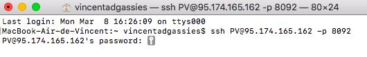
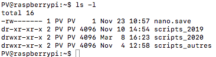
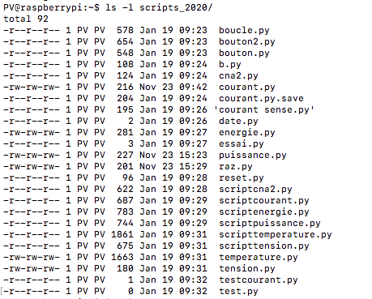
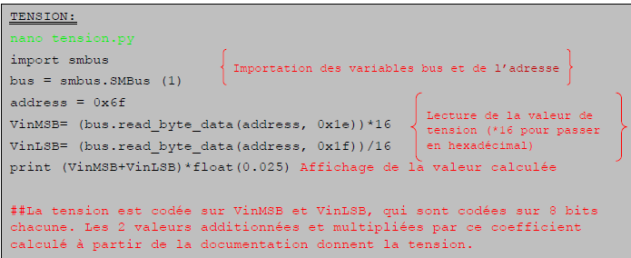

# Partie Supervision

## Programmation du Raspberry (PUTTY)

### Présentation

Pour faire simple, PuTTY vous permet de vous connecter en ssh (protocole de connexion sécurisé) et d’émuler directement le terminal serveur afin de vous permettre d’interagir avec celui ci sans pour autant avoir accès à l’écran ou au clavier.
Dans ce logiciel il est possible de venir écrire des lignes de programme en **python** qui vont nous permettre de venir **lire et échanger** avec un ordinateur à distance (dans notre cas un Raspberry pi4) et obtenir des relevées sur un Pc connecté au même réseau que le Raspberry.

Avec ces programmes, nous sommes maintenant capables de demander au Raspberry les valeurs mesurées par la carte de mesure 

-------------

### Telecharger PUTYY

https://the.earth.li/~sgtatham/putty/latest/w32/putty.exe

-------------

### Connexion a PUTTY
 
<h4 align="center">SUR WINDOWS</h4>
 

**Adresse:** ``95.174.165.162`` 
**Port:** ``8092``  

<h4 align="center">SUR MAC</h4>
 

Ouvrir un terminal et entrer la commande:
``ssh PV@95.174.165.162 -p 8092``

### Identification:

**Identifiant**: ``PV`` 

**MDP**: ``*********``

-------------
### Commande sur PUTTY

Une fois connecté sous putty ou ssh plusieurs commandes de base sont à connaitre :

* Pour lister un dossier : ``ls -l`` 

En écrivant cette commande on retrouve deux dossiers (scripts_2019 et scripts_2020) qui regroupe tout les programmes qui vont nous être utile pour le Raspberry 

* Pour Rentrer dans le dossier, par exemple : ``ls -l scripts_2020/`` 
 voici les dossiers présent dans ce script

* Pour éditer le fichier courant.py par exemple:``nano scripts_2020/courant.py``

* Exécuter un fichier python (courant.py) dans scripts_2020 : ``python3 scripts_2020/courant.py ``

* Pour copier un fichier par exemple (courant.py) du dossier scripts_2019 vers le dossier scripts_2020 : ``cp scripts_2019/courant.py scripts_2020/.``

**D'autres Exemple de communication de base du python** :

``bus.read_byte_data(address, 0x27)`` est une commande qui nous permet en communiquant avec la
Raspberry (bus) de lire une donnée en octet (read_byte_data).

Pour cela, il faut préciser l’adresse de
la carte de mesure que l’on veut interroger (address) ainsi que le registre que l’on veut lire qui est
codé en valeur hexadécimale (0x27). 

``bus.write_byte_data(address, 0x27, 0xff)`` est une commande fonctionnant exactement comme la
commande ci-dessus, elle sert à écrire une valeur dans un registre.

-------------

## Programmation de pyscada

### Presentation de pyscada

Pyscada est une page web generer par le raspberry qui va nous permettre de retransmettre des données 
De ce fait il faut récupérer les données sur putty qui nous permettent ensuite de pouvoir les traiter grâce au logiciel de supervision
. Avec ce logiciel, nous pouvons récupérer les valeurs de nos différentes cartes de
mesure, puis les afficher en graphiques (ou autres), les enregistrer, et y avoir accès à tout moment et
n’importe où.

### Méthode de connexion à Pyscada :

1. Cliquer sur le lien si dessous 
http://95.174.165.162:8090 

2. Apres avoir cliquer sur le lien s'identifier 

 identifiant : ``******``
 
mot de passe : ``*******`` 

### IHM
===
Sur Pyscada, un système de vue est instauré. Une vue englobe des pages et ces pages contiennent le contenu que l'on souhaite afficher, les widgets.

  
		
  
Les widgets permettent d'afficher le contenu que l'utilisateur souhaite afficher dans une page, selon l'ordre d'apparition **(row)**, le positionnement partie gauche ou droite **(col)** et la largeur du contenu **(size)**. Nous verrons cette fonctionnalité plus en détail dans la partie IHM.

Ci dessous le choix des vues lorsque l'on s'est connecté à notre compte:

		.. image:: pic/choix_vue.PNG
		
Et lorsque l'on clique sur la Vue 1:

		.. image:: pic/Expl_vue.jpg
		
Créer une vue
^^^^^^^^^^^^^
Pour créer une vue il suffit de cliquer sur **Add** view :

		.. image:: pic/view.png

Ensuite insérez le titre de la vue, puis les pages qu'elle contiendra. Chaque élément créé est modifiable par la suite, on pourra donc ajouter des pages après avoir créé la vue.

		.. image:: pic/add_view.PNG

Cliquez ensuite sur **Save** et la vue sera créée.

Créer une page
^^^^^^^^^^^^^^

Dans la page d'accueil admin, cliquez sur **Add** dans la ligne page, puis remplissez les paramètres de votre page et cliquez sur **Save**:

		.. image:: pic/add_page.PNG
		
Créer un control item et un control panel
^^^^^^^^^^^^^^^^^^^^^^^^^^^^^^^^^^^^^^^^^

Un control item sert à afficher ou modifier une valeur de variable que l'on a créé auparavant. Le control panel sert à afficher sur l'interface utilisateur la valeur de plusieurs control items.

Pour créer un control item, cliquez sur **Add** dans la ligne control item dans la page d'accueil.
Cette page s'affiche:

				.. image:: pic/add_control_item.PNG
				
Voici l'exemple de nos controls items:

				.. image:: pic/control_item.PNG
				
Pour créer un control panel:

				.. image:: pic/control_panel.PNG

Créer un graphique
^^^^^^^^^^^^^^^^^^

Dans la page d'accueil, cliquez sur **Add** dans la ligne *charts*, puis ajoutez les variables qu'il y aura sur le graphique.

		.. image:: pic/add_chart.PNG
		
Exemple du rendu d'un graphique: Température en fonction du temps.

		.. image:: pic/exemple_graphique.PNG
		
Modélisation de la page
^^^^^^^^^^^^^^^^^^^^^^^

Une fois que les éléments sont créés, l'outil Widget sera nécessaire pour choisir ce qui apparaitra sur l'interface utilisateur.

		.. image:: pic/Widget.PNG
		
Cette page permet d'afficher les controls items définis précédemment. On définit la rangée **(row)**, la colonne **(col)** et la taille **(size)** du contenu qui sera affiché.

		.. image:: pic/add_widget.PNG
		
Le contenu de la rangée 1 apparaîtra en haut de la page, la dernière rangée en bas de la page. Pour les colonnes, la 1ère se situe la plus a gauche et la 4ème la plus à droite. Pour la taille vous avez le choix entre 4 formats: 1/4 qui prendra 1/4 de la rangée. 2/4 pour la moitié de la rangée et ainsi de suite jusqu'à 4/4 pour que le contenu choisi prenne la place d'une rangée complète.

