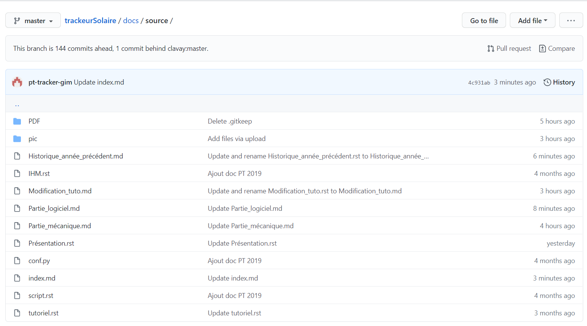
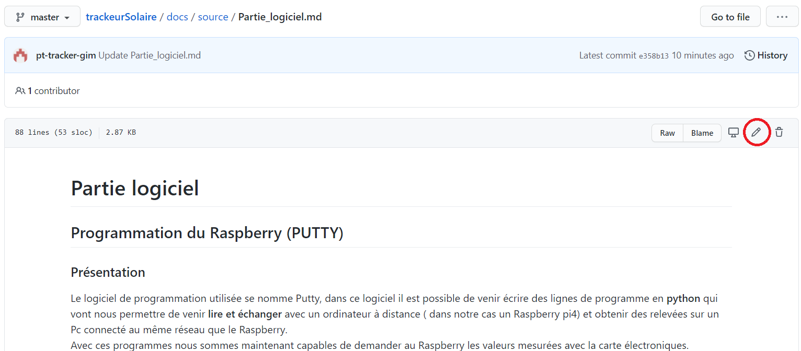
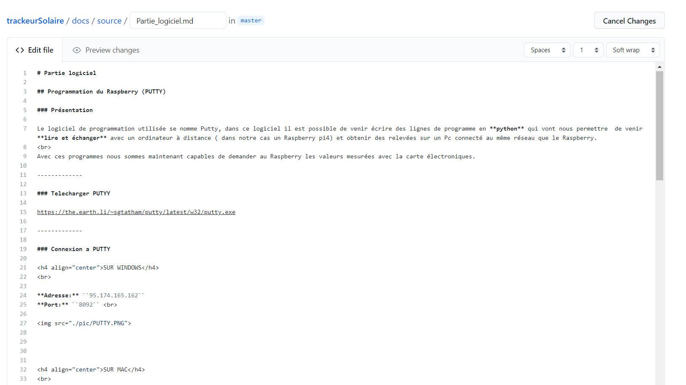

# Modification de la base de données

## Navigation dans GITHUB

### Dossier source

  * **PDF:** Ce dossier regroupe tous les rapports en PDF.
  * **PIC:** Ce dossier regroupe toutes les photos utilisé pour les pages. 
  * Les différent **.md** sont les differentes pages.
  * Le fichier **Index** ...
  * Le fichier **Conf** ...



<br>

## Editer une page

Pour editer une page, il suffit de cliquer sur le stylo. 

 

<br>

Cette page permet de d'écrire et de modifier le texte et les images. 

 

## Texte

* **Crée un titre:**``# titre``
* **Crée un sous-titre:**``## sous-titre``
* **etc... jusqu'a 6 sous titre** ``######``

<br>

* **Pour effectuer des retour a la ligne:**  ``<br>``

<br>

* **Texte en gras:** ``**texte**``

* **Texte en italique:** ``*texte*``

* **Aligné un texte (center; left; right):**``<h4 align="center">texte</h4>``
  * H4 représente la taille du texte
 
 <br> 
 
* **Ligne pour délimité des parties:** ``-----``


## Image

* **Ajouter une image**: ````
   * Dossier: Indiquer le nom du dossier ou la photo se situe 
   * Image: nom de l'image

 
